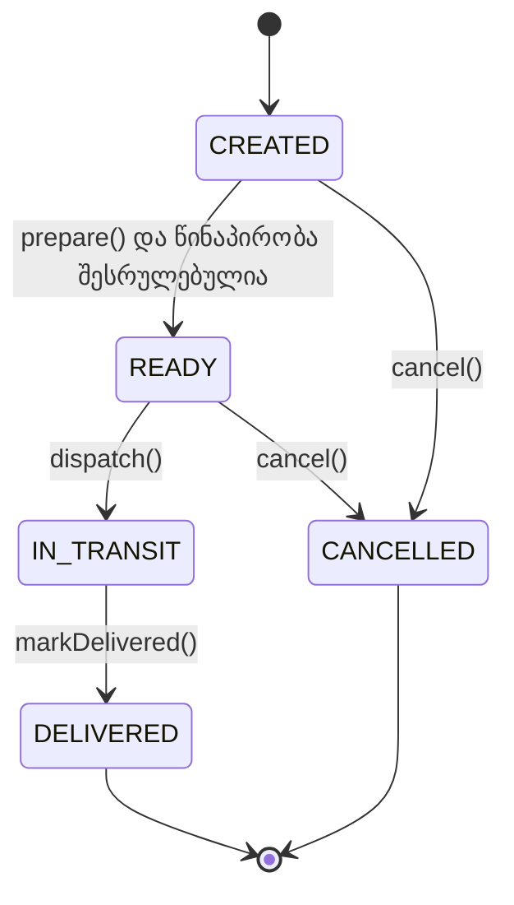

# ფინალური Java პროექტი — „ჭკვიანი მიტანის პროცესი“


ეს არის ინდივიდუალური, 40–60 წუთიანი ფინალური სავარჯიშო Java 17-ში. შენ ააწყობ სახლში და ლოკერში მიტანის პროცესს, სადაც თითოეულ მოქმედებას მხოლოდ განსაზღვრულ მდგომარეობაში აქვს უფლება შესრულდეს.

ამ პროექტში შეგნებულად არ გვჭირდება მასივები, კოლექციები, ძებნა, დათვლა, ჯამი ან manager/utility კლასი. მთავარი გამოწვევაა OOP, enum-ები, მდგომარეობების მართვა და polymorphism.

## რას ივარჯიშებ

- ორი `enum`-ის შექმნას;
- `interface`-ის კონტრაქტის გამოყენებას;
- `abstract class`-ს, ინკაფსულაციასა და მემკვიდრეობას;
- abstract მეთოდების `override`-ს;
- ერთი და იმავე მშობელი ტიპით განსხვავებული ობიექტების გამოყენებას;
- ნებადართული და აკრძალული state transition-ების მართვას.

## სცენარი

მიტანის ობიექტი იქმნება `CREATED` მდგომარეობაში. მომზადება მხოლოდ მაშინ შეიძლება, როდესაც კონკრეტული ტიპის წინაპირობა შესრულებულია: სახლში მიტანისთვის კურიერი უნდა იყოს დანიშნული, ლოკერისთვის კი უჯრა — მზად. მომზადებული შეკვეთა გადადის გზაში, შემდეგ კი ჩაბარებულ მდგომარეობაში.



თუ მოქმედება მოცემულ მდგომარეობაში აკრძალულია, მეთოდმა უნდა დააბრუნოს `false` და სტატუსი უცვლელი დატოვოს.

## შენი დავალება

იპოვე კოდში დანომრილი `TODO`-ები და შეავსე ისინი. კლასებისა და მეთოდების სახელები არ შეცვალო — ავტომატური ტესტები სწორედ ამ API-ს ამოწმებს.

### 1. enum-ები

`DeliveryStatus` უნდა შეიცავდეს:

- `CREATED`
- `READY`
- `IN_TRANSIT`
- `DELIVERED`
- `CANCELLED`

`DeliveryType` უნდა შეიცავდეს `HOME` და `LOCKER` მნიშვნელობებს.

### 2. Trackable interface

მოცემული `Trackable` კონტრაქტი აღწერს სამ მეთოდს:

- `DeliveryStatus getStatus()`
- `String getTrackingMessage()`
- `boolean isFinished()`

`Delivery`-მ ეს interface უნდა განახორციელოს.

### 3. Delivery abstract class

კლასში უკვე მოცემულია private ველები, getter-ები და კონსტრუქტორის validation. დაასრულე ქცევა შემდეგი წესებით:

- ახალი ობიექტის სტატუსია `CREATED`;
- `prepare()`: მხოლოდ `CREATED` მდგომარეობიდან და მხოლოდ მაშინ, როცა `canPrepare()` აბრუნებს `true`-ს; წარმატებისას ახალი სტატუსია `READY`;
- `dispatch()`: მხოლოდ `READY → IN_TRANSIT`;
- `markDelivered()`: მხოლოდ `IN_TRANSIT → DELIVERED`;
- `cancel()`: მხოლოდ `CREATED` ან `READY` მდგომარეობიდან გადადის `CANCELLED`-ში;
- `isFinished()`: `true` მხოლოდ `DELIVERED` და `CANCELLED` მდგომარეობებისთვის;
- ყველა აკრძალული მოქმედება აბრუნებს `false`-ს და არაფერს ცვლის.

თვალთვალის ტექსტის ზუსტი ფორმატია:

```text
<trackingCode> | <type> | <status> | <destinationLabel>
```

მაგალითი: `PKG-202 | LOCKER | IN_TRANSIT | ლოკერი: TB-07`

### 4. კონკრეტული მიტანის ტიპები

`HomeDelivery`-ში:

- ტიპია `HOME`;
- მომზადება შეიძლება მხოლოდ მაშინ, როცა `courierAssigned` არის `true`;
- destination label-ის ფორმატია `მისამართი: <address>`.

`LockerDelivery`-ში:

- ტიპია `LOCKER`;
- მომზადება შეიძლება მხოლოდ მაშინ, როცა `compartmentReady` არის `true`;
- destination label-ის ფორმატია `ლოკერი: <lockerId>`.

## მუშაობის რეკომენდებული რიგი

1. **0–10 წუთი:** გაეცანი კლასებს, დიაგრამასა და ტესტების სახელებს.
2. **10–20 წუთი:** შეავსე enum-ები და საწყისი სტატუსი.
3. **20–35 წუთი:** ააწყე `Delivery`-ის state transition-ები.
4. **35–45 წუთი:** დაასრულე ორივე შვილობილი კლასის override-ები.
5. **45–60 წუთი:** გაუშვი ტესტები, წაიკითხე შეცდომები და გაასწორე ქცევა.

## პროექტის გაშვება

IntelliJ IDEA-ში გახსენი ეს საქაღალდე როგორც Maven პროექტი და დარწმუნდი, რომ Project SDK არის Java 17.

Windows Terminal-ში:

```powershell
.\mvnw.cmd test
```

macOS/Linux-ზე:

```bash
./mvnw test
```

წარმატებით დასრულებული თითოეული ძირითადი ტესტი 10 ქულაა.

| თემა | ქულა |
|---|---:|
| enum-ები და interface | 20 |
| abstract class და ინკაფსულაცია | 20 |
| მდგომარეობების სწორი გადასვლები | 30 |
| subclass override-ები და მზადყოფნის წესები | 20 |
| `Trackable` polymorphism | 10 |
| **სულ** | **100** |
| არჩევითი bonus | **+10** |

## მინიშნებები

<details>
<summary>მინიშნება 1 — როგორ შევამოწმო გადასვლა?</summary>

ჯერ შეადარე მიმდინარე სტატუსი იმ ერთადერთ მდგომარეობას, საიდანაც მოქმედება ნებადართულია. სტატუსი მხოლოდ წარმატებული შემოწმების შემდეგ შეცვალე.

</details>

<details>
<summary>მინიშნება 2 — რისთვისაა canPrepare()?</summary>

`Delivery` იცის, რომ მზადყოფნა უნდა შემოწმდეს, მაგრამ კონკრეტული პირობა შვილობილმა კლასმა იცის. ამიტომ მშობელი მეთოდი იძახებს polymorphic `canPrepare()`-ს.

</details>

<details>
<summary>მინიშნება 3 — როგორ ავაწყო tracking message?</summary>

გამოიყენე საერთო ველები და გამოიძახე override-ებული `getType()` და `getDestinationLabel()`. გამყოფის ორივე მხარეს თითო space უნდა იყოს.

</details>

<details>
<summary>მინიშნება 4 — რატომ არ უნდა შეიცვალოს სტატუსი შეცდომისას?</summary>

ჯერ დააბრუნე `false`, თუ წინაპირობა არ შესრულდა. სტატუსის მინიჭების ხაზამდე პროგრამა მხოლოდ ნებადართული შემთხვევისას უნდა მივიდეს.

</details>

## არჩევითი bonus — PickupDelivery (+10)

თუ ძირითადი 100 ქულა დაასრულე:

1. `DeliveryType`-ს დაუმატე `PICKUP`;
2. შექმენი `PickupDelivery`, რომელიც მემკვიდრეობით იღებს `Delivery`-ს;
3. დაამატე `pickupPoint` და `pickupCodeActive` ველები;
4. გამოიყენე კონსტრუქტორი `(String trackingCode, String recipientName, String pickupPoint, boolean pickupCodeActive)`;
5. მომზადება დაუშვი მხოლოდ აქტიური pickup code-ისას;
6. destination label-ის ფორმატი იყოს `პიკაპის პუნქტი: <pickupPoint>`.

Bonus ტესტი ცალკე გაუშვი:

```powershell
.\mvnw.cmd -Pbonus test
```

Bonus-ის ჩავარდნა ძირითად 100 ქულას არ აკლებს.

## GitHub-ზე ატვირთვის შემდეგ

Workflow ავტომატურად გაეშვება ყოველ `push`-ზე, pull request-ზე და ხელით გაშვებისას. GitHub-ის **Actions → სავარჯიშოს შემოწმება → Summary** გვერდზე გამოჩნდება ქულა და თემების მოკლე ცხრილი. ძირითადი ტესტის ჩავარდნისას workflow წითელი იქნება, თუმცა Summary მაინც შეიქმნება.

README-ის ზედა badge რომ ამუშავდეს, `OWNER/REPOSITORY` ჩაანაცვლე შენი GitHub მომხმარებლის სახელითა და repository-ის სახელით.
